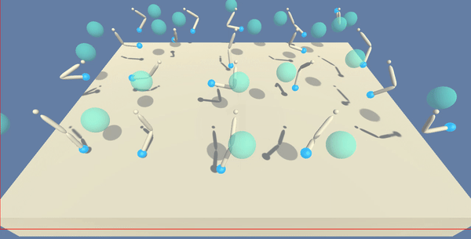

# Project 2: Continuous Control

This repository includes all the needed information to train a double-jointed arm agent to move to target location, similar to UNITY Machine Learning Agents. The latter, works as enviroments to train intelligent agents. This case a simulation of robotic arm following a target ball.
In this notebook, you will learn how to use the Unity ML-Agents environment for the second project of the [Deep Reinforcement Learning Nanodegree](https://www.udacity.com/course/deep-reinforcement-learning-nanodegree--nd893). As shown above we say the arm is following the ball when is green:

  

### What is this about?
We are going to use **Actor Critic** method to solve this enviroment. Specifically **Deep Deterministic Gradient Policy**. We are using this algorithm since we have a continous action space (that we will go further on that below). Our goal is to find an optimal policy, through selecting desired actions (in a continous space) and use those actions to produce Q-values for more information, visit report.pdf.

### More abour this enviroment

For this project, we will work with the [Reacher](https://github.com/Unity-Technologies/ml-agents/blob/master/docs/Learning-Environment-Examples.md#reacher) environment from Unity.

This environment consist of a double-jointed arm moving to target locations, for example, following a ball. A **reward of +0.1** is provided for each step that the agent's hand is in the goal location. Thus, the goal of your agent is to maintain its position at the target location for as many time steps as possible.

The observation space consists of 33 variables corresponding to position, rotation, velocity, and angular velocities of the arm. Each **action** is a **vector with four numbers**, corresponding to torque applicable to two joints. Every **entry** in the action vector should be a **number between -1 and 1**. We will only train one agent and we would say it has been done when we get an average score of more than 30 over 100 consectuive episodes.

### How to install everything needed
Create a new **conda** enviroment with Python 3.6. Using `conda create --name drlnd python=3.6; source activate drlnd`.
Also install OpenAI Gym using `pip install gym`. Once you have done that you can automatically use enviroments such as classic control and box2d. You should clone the following repository as follows: `git clone https://github.com/udacity/deep-reinforcement-learning.git; cd deep-reinforcement-learning/python; pip install .`. Finally to create a Jupyter Notebooks Kernel (IPython Kernel) run `python -m ipykernel install --user --name drlnd --display-name "drlnd"` And go inside **p2_continous-controll** and you will find the continous_controll notebook. If you will like to train on AWS go to https://s3-us-west-1.amazonaws.com/udacity-drlnd/P2/Reacher/one_agent/Reacher_Linux_NoVis.zip
Download your banana folder 
* For linux on: https://s3-us-west-1.amazonaws.com/udacity-drlnd/P2/Reacher/one_agent/Reacher_Linux.zip
* For Mac OSX on: https://s3-us-west-1.amazonaws.com/udacity-drlnd/P2/Reacher/one_agent/Reacher.app.zip
* For Windows: https://s3-us-west-1.amazonaws.com/udacity-drlnd/P2/Reacher/one_agent/Reacher_Windows_x86.zip

### How to use the code found here
Make sure your Notebook file is on the same path as you Reacher enviroment folder, inside should contain Reacher execution files. Also we include agent.py that includes a class with all the AGENT information, each step and action that is made also a ReplayBuffer class to store experience tuple and a noise generation class. This file imports model.py file with Pytorch framework with 2 neural networks, both with same architecture, 3 fully connected layers of 400 units and 300 units on hidden layers. 

### Solved
Here is the gif of the solved enviroment using 20 agents. Here you can find the code for 20 agents trainning and 1 agent only.

  

#### Some resources that I found usefull when implementing
* https://github.com/MoritzTaylor/ddpg-pytorch
* https://keras.io/examples/rl/ddpg_pendulum/
* https://www.youtube.com/watch?v=6Yd5WnYls_Y
* https://github.com/ghliu/pytorch-ddpg/blob/master/ddpg.py
